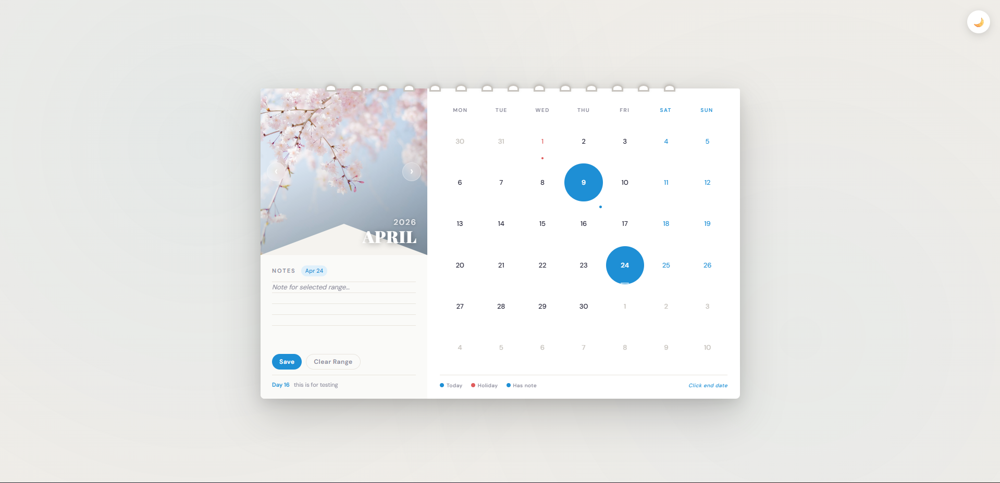
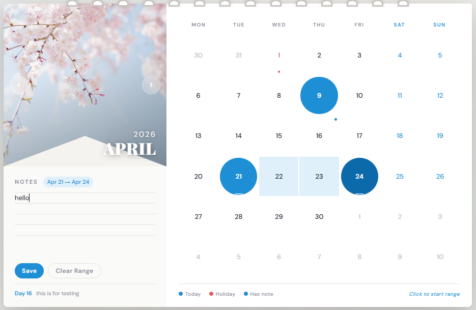
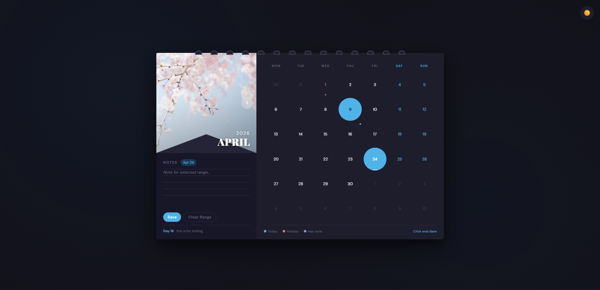

# 📅 Interactive Spiral Calendar Pro

An aesthetic and interactive **React-based wall calendar application** designed to resemble a **physical spiral-bound calendar**.  
The project focuses on combining **beautiful UI design with useful productivity features** like date range selection, note taking, holiday indicators, and smooth month navigation.

It demonstrates **React state management, dynamic calendar logic, and modern UI interactions**.

---

# 📸 Visual Preview

### 1️⃣ Main Interface (Light Mode)

> Add screenshot here



---

### 2️⃣ Range Selection & Note Taking

> Add screenshot showing selected date range and notes



---

### 3️⃣ Dark Mode Toggle

> Add screenshot of dark theme



---

# ✨ Features

### 📅 Dynamic Calendar Grid
- Automatically generates the calendar for any month and year
- Maintains a **perfect 6×7 calendar grid**
- Displays previous and next month overflow days in a dimmed style

---

### 🎨 Spiral-Bound Wall Calendar UI
- Custom **CSS spiral binding**
- Clean **two-panel layout**
- Seasonal **hero image for every month**

---

### 🌓 Light & Dark Theme
- Toggle between **light mode** and **dark mode**
- Implemented using dynamic CSS class switching

---

### 🖱️ Smart Date Range Selection

Users can select a range of dates easily:

1. Click once → Select **start date**
2. Hover → Preview selected range
3. Click again → Confirm **end date**

The selected dates are visually highlighted.

---

### 📝 Built-in Notes System

The calendar allows two types of notes:

**1️⃣ General Monthly Notes**
- Notes related to the whole month

**2️⃣ Specific Date Notes**
- Notes attached to selected dates or ranges

Saved notes appear with a **dot indicator on the calendar cell**.

---

### 🎢 Smooth Month Navigation

Navigate between months using arrow buttons.

Features:
- Smooth **flip animation**
- Automatic **year transition**
- Resets date selections when changing month

---

### 🎊 Holiday Indicators

The calendar highlights predefined holidays.

Hovering over a holiday shows its name as a tooltip.

Example:

```javascript
const HOLIDAYS = {
 "1-1": "New Year's Day",
 "2-14": "Valentine's Day",
 "3-8": "Women's Day",
 "4-1": "April Fools",
 "5-1": "Labour Day",
 "10-31": "Halloween",
 "12-25": "Christmas"
}
```

---

# 🚀 Getting Started

## 1️⃣ Clone the Repository

```bash
git clone https://github.com/shramitamaheshwari/Interactive-calendar-component-/tree/main
cd Interactive-calendar-component-
```

---

## 2️⃣ Install Dependencies

```bash
npm install
```

---

## 3️⃣ Run the Project

```bash
npm start
```

Open in browser:

```
http://localhost:3000
```

---

# 📁 Project Structure

```
project-folder
│
├── public
│
├── src
│   ├── App.jsx        # Main calendar logic    
│   └── App.css        # Calendar UI styling
│
├── images
│   ├── main-ui.png
│   ├── range-selection.png
│   └── dark-mode.png
│
├── package.json
└── README.md
```

---

# 🧩 Technical Details

**Framework**
- React (Hooks)

**Languages**
- JavaScript (ES6)

**React Hooks Used**
- `useState`
- `useEffect`
- `useRef`

**UI Techniques**
- CSS Grid
- Flexbox
- CSS Animations
- Dynamic class styling

---

# ⚙️ Customization

## Changing Monthly Images

Edit the `MONTH_IMAGES` array inside `App.js`:

```javascript
const MONTH_IMAGES = [
 "your-january-image.jpg",
 "your-february-image.jpg",
 "your-march-image.jpg"
];
```

---

## Adding Holidays

Add entries to the `HOLIDAYS` object:

```javascript
const HOLIDAYS = {
 "8-15": "Independence Day",
 "1-26": "Republic Day"
}
```

---

# 💡 Future Improvements

Possible enhancements for future versions:

- 📱 Mobile responsive layout
- 🔔 Reminder notifications
- ☁ Cloud sync for notes
- 📆 Google Calendar integration
- 🎨 Event color categories
- 👥 Shared calendar functionality

---

# 👩‍💻 Author

**Shramita Maheshwari**

GitHub:  
https://github.com/shramitamaheshwari

---

# 📜 License

This project is licensed under the **MIT License**.

Feel free to use and modify it for learning or personal projects.